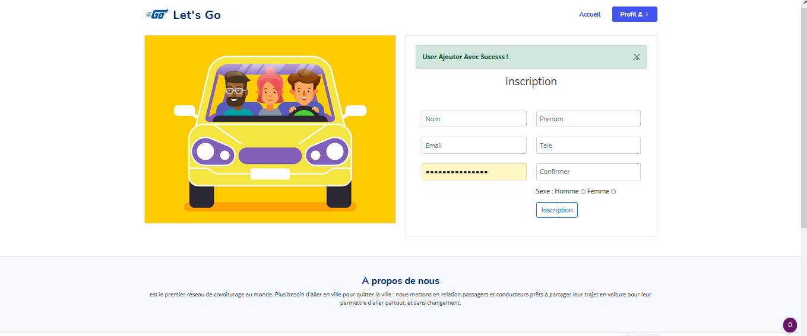
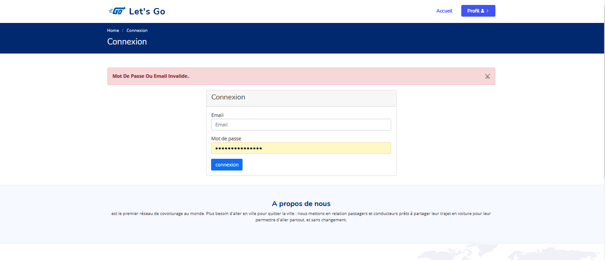
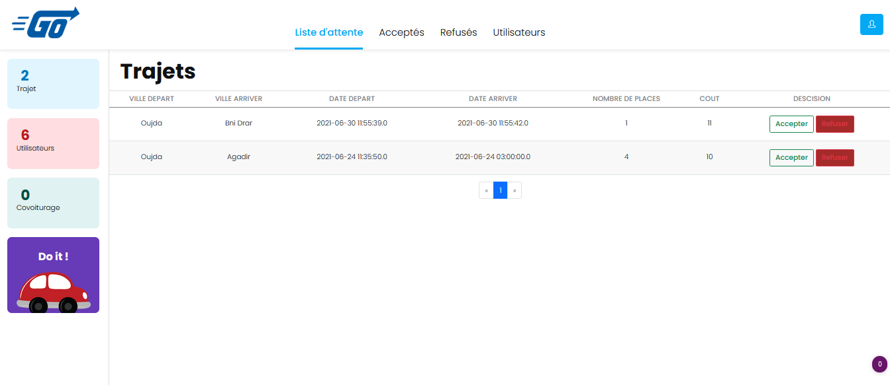

# Lets'go Car Pooling 

---

## Description

- Lets'go a site for managing carpooling

#### Fonctionnalites

- Register user
- CRUD Travels
- Login based On The Role (N_User/S_User)
- Dahsbord Admin accept or reject propsed travel
- Validation For The Inputs

---

#### Technologies

- java
- Spring Boot
- thymeleaf template engine
- boostrap 4
- mysql

---

#### conf

- Create the Database Using The script pfa_con.sql

- Change The database Props (UserName/Pass .....) in application.properties

---

#### Tools

- Intellij
- Vscode + Spring extension Pack
- Xampp
